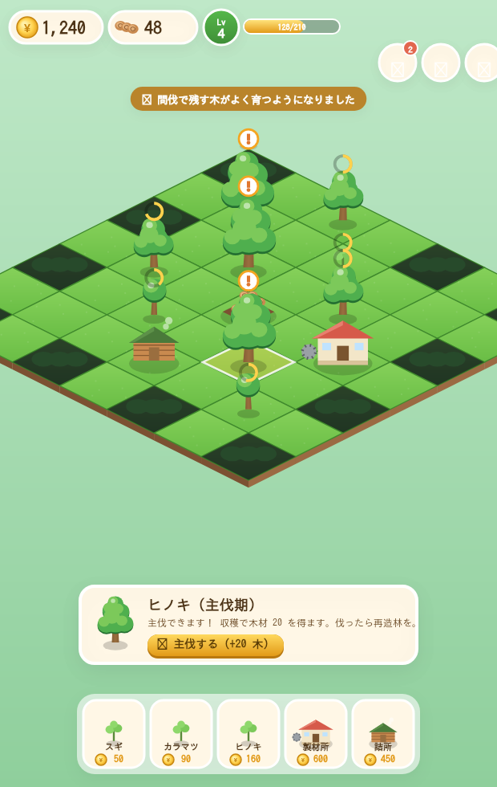

# 🌲 もりのこ 〜林業タウン〜

木を**植え・育て・伐り・運ぶ**——林業の一連の流れを遊びながら学べる、ブラウザ用の経営シミュレーションゲームです。アイソメトリックの箱庭で森を広げ、木材を売って町を大きくしていきます。

> **ビルド不要・外部アセットゼロ。** `index.html` をブラウザで開くだけで動きます（PC・スマホ対応）。アート・効果音・アニメーションはすべてコードで生成しています。



## 🎮 遊び方

1. `index.html` を開いて「▶ はじめる」。
2. 明るい芝マス（空き地）をタップ → **苗木を植える**（スギ・カラマツ・ヒノキ）。
3. 時間が経つと木が成長します：🌱 苗木 → 🌿 若木 → 🌲 成木 → 🌳 主伐期。
4. 🌳マークが出たら木をタップして **主伐（収穫）** → 木材が手に入ります。
5. 中央の **土場（どば）** をタップして **出荷** → 木材が現金に（市況で価格が変動）。
6. コインで **土地の開拓**・**製材所**・**林業詰所** を建てて経営を拡大！
7. **クエスト**（🎯）をこなすと報酬がもらえます。

**操作**：ドラッグで移動 / マウスホイール・ピンチで拡大縮小 / タップで選択。

## ✨ 特徴（クオリティ）

- **アイソメトリックの箱庭**：手前後ろのソート描画、カメラのパン＆ズーム。
- **ジューシーな手触り**：植える・伐る・売るたびに、木くず／落ち葉／コイン／きらめきのパーティクル、弾むアニメーション、フローティングテキスト、丸太が土場へ飛ぶ運搬演出、画面シェイク。
- **手描き風プロシージャルアート**：木の4段階・建物・地形・動物・アイコンをすべてキャンバスに描画（画像ファイル不要）。
- **手続き的サウンド＆BGM**：Web Audio の効果音・森のアンビエント・季節で曲調が変わるBGM。
- **進行システム**：レベル＆XP、施設・樹種のアンロック、クエスト、土地拡張、経営アップグレード。
- **セーブ**：`localStorage` に自動保存（木はオフライン中も成長）。

## 🌟 やり込み要素（大型アップデート）

- **季節サイクル 🌸☀️🍁❄️**：春は成長アップ・冬はダウン。空と芝の色が変わり、桜・落ち葉・雪が舞います。
- **ランダムイベント**：🌀 台風（詰所で被害軽減）/ 🐛 病虫害（タップで防除、放置で枯死＆隣へまん延）/ 📈 価格高騰（出荷チャンス）/ 🏛️ 補助金 / ✨ 黄金の木（大収入）。
- **野生動物と生物多様性 🐾**：木を増やし種類を多くするとスコアが上がり、小鳥・ウサギ・リス・シカ・キツネがやってきます。補助金や黄金の木も手厚くなります。
- **コンボ収穫**：短時間に連続で主伐すると倍率アップ。
- **経営アップグレード 🔧**：早生品種（成長）/ 林道整備（売値）/ 育苗ハウス（苗木コスト）/ 高性能林業機械（収量）を強化。

## 📚 学べる林業のポイント

- **植林 → 育成 → 間伐 → 主伐 → 運搬・販売** の一連の流れ
- **再造林**：伐ったあと植え直して森を未来へつなぐ
- **間伐**：混んだ木を間引いて残す木を育てる（成長促進ボーナス）
- **土場と運搬**：丸太を集めてまとめて運ぶ効率の大切さ
- **製材（一次加工）**：板材にして付加価値を高める（売値アップ）
- **経営・市況**：価格変動を踏まえた長期の意思決定
- 各操作・クエストに **林業まめ知識** を表示

## 🗂️ ファイル構成

```
index.html       画面・HUD
src/style.css    UIテーマ（イラスト調・モバイル最適化）
src/sprites.js   プロシージャル描画（木・建物・地形・アイコン）
src/fx.js        トゥイーン＆パーティクル（ジュース演出）
src/audio.js     Web Audio 効果音・アンビエント
src/game.js      ゲーム本体（箱庭・経済・進行・クエスト・セーブ）
```

## 🧪 動作確認

DOM/Canvas をスタブ化したヘッドレス煙テストで、起動〜「植える→成長→主伐→出荷→クエスト」の一連がランタイムエラーなく動作することを確認済みです。

## 🚀 今後の拡張アイデア

- 季節・天候サイクルと作業適期（植付けは春、下刈りは夏 など）
- 傾斜・路網整備・搬出距離のコスト
- 板材・チップなど加工品の在庫と需要
- 認証材（FSC等）・生物多様性スコア
- 実績／図鑑、BGM
